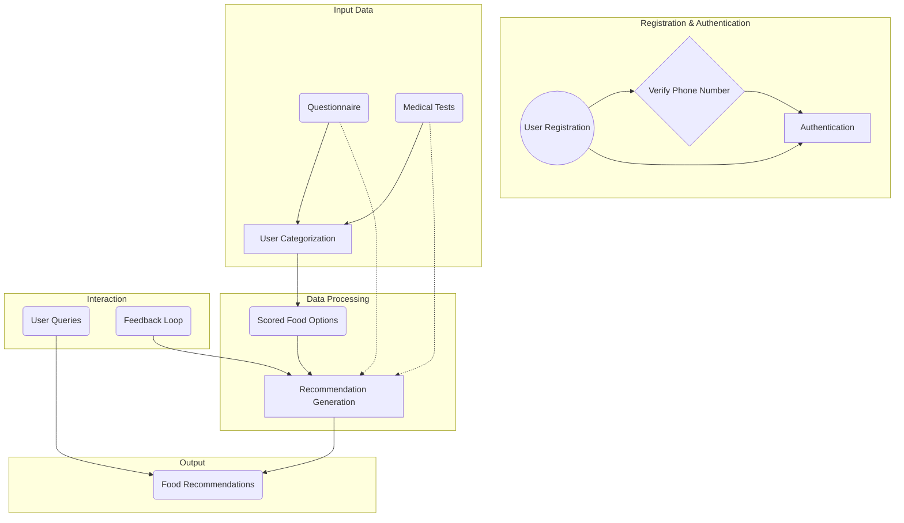

# App Overview

The app, is a dietary management application designed to assist users in making informed food choices based on their individual nutritional needs and preferences. It utilizes a combination of user input, nutritional data, and personalized scoring algorithms to generate tailored recommendations for optimal health outcomes.

## Use Case

### User Authentication
 **Authentication**: Users phone numbers are verified to access the AI chat on Whatsapp.

### Data Processing
1. **User Categorization**: Based on the questionnaire responses and medical test results, users are categorized into health groups.
2. **Food Scoring**: The app scores each food item in its database based on various factors such as nutritional content, sugar response, fat response, and gut response.
3. **Recommendation Generation**: Using the user's health group and dietary preferences, the app generates personalized food recommendations.
   
### Output
1. **Scored Food Options**: Users receive a list of scored food options, sorted based on their suitability for the user's health group and dietary preferences.
2. **Food Recommendations**: The app provides recommendations for food combinations that align with the user's health goals and preferences.

### Interaction
1. **User Queries**: Users can query the app for specific food items or meal recommendations tailored to their needs.
2. **Feedback Loop**: Users can provide feedback on recommended food items, helping to refine recommendations.

## Key Features
- **Personalization**: Tailored recommendations based on individual health profiles and dietary preferences.
- **Scalability**: The app can accommodate a growing user base while maintaining performance and accuracy.
- **Feedback Mechanism**: Continuous improvement through user feedback loops to enhance recommendation accuracy.
- **Secure Authentication**: Robust phone number-based authentication ensures user data security.
